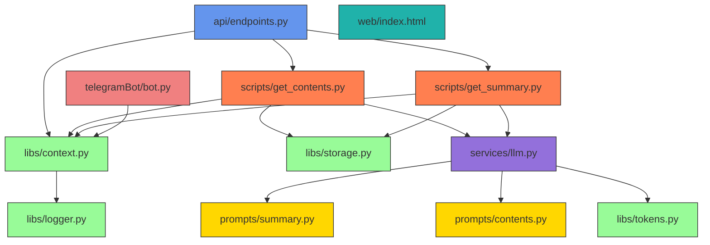

# Практика

## Встановлення та запуск
### Налаштування файлу config.env:
Перш за все він має обов'язково лежати в корені проекту.
В цьому файлі є три змінні, які можна налаштовувати під себе:

```config.env
OPENAI_API_KEY=...     Для роботи OpenAI API
PATH_INPUT_FILE=...    Для скриптів
PATH_RESULT_FILE=...   Для скриптів
```

### Необхідно завантажити проект та ці модулі:

```terminal
pip install python-dotenv python-telegram-bot requests openai pydantic fastapi uvicorn
```

Також для розміщення локального серверу в інтернеті я використав програму ```ngrok```, яку можна встановити з сайту: https://ngrok.com.

Команда для запуску:

```
ngrok http 8000
```

### 1) Запуск скриптів:
За це відповідають два файли: ```get_contents.py``` та ```get_summary.py``` з папки ```scripts```. 

### 2) Запуск через REST API:
Для цього в терміналі необхідно запустити локальний сервер командою:

```terminal
uvicorn api.endpoints:app --reload
```

Після цього виконати один з двох файлів (відповідно до того, який результат хочете отримати): ```sum.py``` та ```contents.py``` з папки ```api```. 

### 3) Запуск через веб-інтерфейс:
Для цього в терміналі необхідно запустити локальний сервер командою:

```terminal
uvicorn api.endpoints:app --reload
```

Та перейти в браузері за цим посиланням: ```http://127.0.0.1:8000```. На сайті обрати необхідний режим.

### 4) Запуск telegram бота:
Для цього в терміналі необхідно запустити локальний сервер командою:

```terminal
uvicorn api.endpoints:app --reload
```

Після цього запустити ```ngrok```, в ньому отримати адресу, яку потім підставити у файлі ```telegramBot\bot.py``` в ```API_URL_1``` та ```API_URL_2``` перед ```/api/v1/get_summary``` та ```/api/v1/get_contents_and_theses```. Після цього знайти бот в telegram за посиланням https://t.me/TXT_OpenAI_Analyzer_Bot.

## Приклад використання
### Режим 1:
#### Формування короткого підсумку документа
Запускаємо відповідно до вище описаного способу.

Результат в консолі:


  
Результат в файлі:
  
```
Документ досліджує вплив COVID-19 на дистанційне навчання в Україні, зокрема на рівень знань і академічну мотивацію студентів. Згідно з дослідженням, у якому взяли участь 850 студентів, 63% респондентів відзначили зниження рівня засвоєння матеріалу в онлайн-форматі через низьку залученість і технічні труднощі. Однак 25% студентів визнали позитивні аспекти дистанційного навчання, такі як гнучкість графіка. Автори рекомендують комбінувати онлайн- і офлайн-навчання після пандемії та покращити цифрову підготовку викладачів.
```

### Режим 2: 

#### Формування короткого підсумку документа
Запускаємо відповідно до вище описаного способу.

Результат в консолі (відповідь від серевера):

```
{'summary': 'Документ досліджує вплив пандемії COVID-19 на освіту, зокрема перехід до дистанційного навчання в Україні. За результатами опитування 850 студентів з 10 вищих навчальних закладів, 63% студентів вважають, що рівень засвоєння матеріалу під час онлайн-занять нижчий, ніж під час традиційного навчання, через низьку залученість та технічні труднощі. Водночас 25% студентів відзначили позитивні моменти, такі як гнучкість графіка. Автори рекомендують інтегрувати елементи онлайн- і офлайн-навчання в майбутньому та забезпечити кращу цифрову підготовку викладачів.'}
```

  
До файлу нічого не записується.

### Режим 3:

#### Формування короткого підсумку документа
Запускаємо відповідно до вище описаного способу.

Відкривається такий сайт з найпростішим дизайном:


- Обираємо файл, обов'язково формату .txt, інакше з'явиться alert про те, що неправильний формат.
- Обираємо в випадаючому списку, що саме потрібно зробити з цим файлом.
- Натискаємо кнопку "Проаналізувати".
- Чекаємо поки відбувається аналіз.

Результат очікування: 


### Режим 4:

#### Формування короткого підсумку документа
Запускаємо відповідно до вище описаного способу. Та взаємодіємо з ботом.


## Структура логов та метрик

### Логи

Логи зберігаються в файлі `logs/logs.log` та мають наступний формат:

```
[TIMESTAMP] [LEVEL] - Message
```

Приклад:


### Метрики

Метрики зберігаються в файлі логів, пвісля кожної операції:

Після будь-якої операції виводиться час виконання.
Після операцій з OpenAI ще виводиться кількість затрачених токенів.


## Діаграма системи


